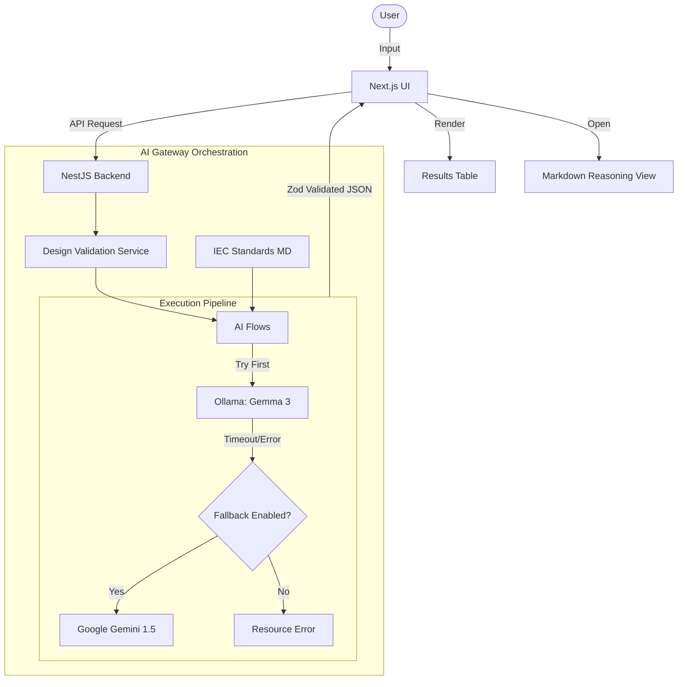

# Volta: Hybrid AI Cable Design Validation System

Volta is a sophisticated validation platform designed to ensure low-voltage cable designs comply with international engineering standards, specifically **IEC 60502-1** and **IEC 60228**. Volta utilizes a unique **Hybrid AI Gateway** that prioritizes local processing via **Ollama** with a seamless failover to **Google Gemini**, providing intelligent, standards-grounded validation even in resource-constrained environments.

## System Overview

Volta is built as a production-ready, decoupled full-stack system. Unlike rigid rule-based engines, Volta utilizes a **context-based reasoning engine** where a hybrid AI infrastructure interprets design parameters against real-world technical standards.

### Core Philosophy: Reasoning-First Validation

*   **Hybrid AI Strategy**: Local-first processing using Ollama (Gemma 3) for privacy and speed, with cloud fallback (Gemini 1.5) for reliability and enhanced reasoning.
*   **Standards Contextualization**: The system dynamically reads markdown-based IEC standards from the `/standards` directory and injects them into the AI's context.
*   **Transparent Engineering**: The AI doesn't just pass/fail; it provides a **Solution Based on IEC Standards** by citing specific tables and clauses.
*   **Audit-Ready Transparency**: A dedicated **Reasoning Drawer** with Markdown support renders detailed technical justifications.

### Key Capabilities

*   **Hybrid AI Gateway**: Automatic local-to-cloud fallback with resource-aware error logging (RAM/VRAM monitoring).
*   **Standards-Context Validation**: Real-time checking against IEC 60502-1 (Construction) and IEC 60228 (Conductors).
*   **Intelligent Extraction**: Natural language parsing that detects irrelevant/nonsensical input and returns specific "Invalid Input" errors.
*   **Markdown Reasoning Engine**: Structured technical feedback with bold citations, lists, and confidence scoring.
*   **Multi-Input Support**: Accept structured JSON, raw technical descriptions, or existing MongoDB records.

### System Flow (Hybrid Architecture)



## AI Validation Methodology

Volta moves beyond simple "if-else" checking by treating validation as a high-stakes technical audit. The system methodology follows four core principles:

1.  **Grounding in Reality**: Every validation request is paired with the actual text of IEC 60502-1 and IEC 60228. The AI is not allowed to rely on its "common knowledge"; it must verify every parameter against the provided technical context.
2.  **Semantic Engineering Logic**: The AI reasoning engine understands various technical abbreviations (sqmm, mm²) and maps them contextually to standard engineering units, allowing expert-level semantic analysis of technical text without hardcoded conversion maps.
3.  **No Hardcoded Rules**: **CRITICAL**: The system intentionally contains zero hardcoded IEC rules, lookup tables, or threshold values. All validation logic and engineering comparisons are performed by the AI reasoning against the provided standards context.
4.  **Contract-Driven Inference**: We use Zod schemas to ensure that the AI's "thoughts" are translated into a strictly typed JSON structure. If the AI's reasoning doesn't fit the expected engineering format, the system rejects it before it reaches the end user.
5.  **The "Safety Margin" Warning System**: If a design parameter is technically compliant but near the minimum threshold, the AI identifies it as a `WARN` instead of a `PASS`, explaining the risk (e.g., thermal performance or mechanical durability).

## Validation Toolkit

To achieve industrial-grade reliability, Volta integrates the following tools:

- **Zod**: Forces the AI to output valid, structured engineering data. It acts as the "contract" between the LLM and the application logic.
- **Axios with AbortControllers**: Manages local Ollama calls with strict timeouts. If a local model hangs due to resource constraints, the system detects the cancellation and pivots to fallback providers.
- **Standards Context Reader**: A specialized utility in `backend/src/ai-gateway/context.ts` that dynamically assembles relevant IEC tables into a machine-readable prompt extension.

### 4. Confidence Scoring (Calculation Logic)
The `confidence.overall` score (0.0 to 1.0) is not a random number; it is calculated by the AI based on three weighted factors:
1.  **Data Completeness (40%)**: Does the input specify the standard, voltage, material, and dimensions? Missing critical fields lower the score.
2.  **Standards Grounding (40%)**: How clearly does the input match the provided IEC tables? A direct match (e.g., 10mm² found in Table 15) increases confidence.
3.  **Semantic Clarity (20%)**: Is the input ambiguous? Use of non-standard units or contradictory terms (e.g., "XLPE PVC cable") reduces confidence.

## Validation Signal Logic

The system uses three distinct signals to communicate design health:

- ✅ **PASS**: The parameter matches or exceeds the nominal requirements defined in the IEC standards context with a safe margin.
- ⚠️ **WARN**: 
    - **Boundary Case**: The parameter meets the requirement but has zero or minimal safety margin.
    - **Missing Data**: A critical field (like Voltage or Standard) was missing and the AI had to make a "best-guess" assumption based on common engineering practice.
- ❌ **FAIL**: The parameter strictly violates the minimum/maximum thresholds defined in the standards context.

---

## Core System Prompts

Volta's precision is driven by three specialized AI flows, optimized to handle the [Validation Test Matrix](#validation-test-matrix).

### 1. Data Extraction Flow
> **Purpose**: Parses technical descriptions into structured JSON.

```text
You are a Cable Engineering Data Extractor. 
Parse technical descriptions into valid JSON.
Return ONLY valid JSON. 

JSON Structure:
{
  "isInvalidInput": boolean,
  "standard": string,
  "voltage": string,
  "conductorMaterial": string,
  "conductorClass": string,
  "csa": number,
  "insulationMaterial": string,
  "insulationThickness": number
}

Note: Understand technical abbreviations (e.g., "sqmm", "mm2", "Cu"). 
Map them to their standard engineering meanings.
```

### 2. Structured Design Validation Flow
> **Purpose**: Audits design data with high technical rigor.

```text
You are an expert Cable Design Validator for IEC 60502-1 and IEC 60228.
Use the provided standards context ONLY to validate cable designs.
Compare provided values EXACTLY against threshold limits.

SIGNALS:
- PASS: Meets requirement with margin.
- WARN: Missing critical fields (Standard/Voltage) or at nominal threshold limit.
- FAIL: Strictly below/above standards thresholds.

CRITICAL: Your "aiReasoning" MUST cite the specific IEC table (e.g., "Per IEC 60502-1 Table 15...").
```

### 3. Free-Text Engineering Flow
> **Purpose**: Expert-level analysis of complex natural language descriptions.

```text
You are a Cable Engineering Expert.
1. Extract parameters and normalize technical units.
2. Validate against IEC 60502-1 and IEC 60228 strictly using context.

CRITICAL:
- If Standard/Voltage is missing, set a WARN signal and state assumption in Reasoning.
- If insulation < nominal minimum, set a FAIL signal.
- If insulation = nominal minimum, set a WARN signal (Borderline).
```

---

### Technical Flow Breakdown

1.  **Ingestion Phase**: The Next.js frontend captures technical data. Nonsensical input is flagged at the AI layer with specialized error messages.
2.  **Hybrid Orchestration**: The `DesignValidationService` attempts local inference first. If Ollama times out (typically due to local RAM/VRAM constraints), the system automatically initiates a fallback to Gemini if configured.
3.  **Standards Grounding**: Technical context from `/standards` is injected into every AI prompt, forcing the model to cite specific IEC clauses (e.g., "Per IEC 60502-1 Table 15...").
4.  **Presentation Phase**: Results are mapped to a professional DataGrid with automatic text wrapping for long comments. A slide-out drawer provides the full technical justification in structured Markdown.

## Architecture and Technology Stack

### Backend (NestJS)
*   **Orchestration**: NestJS with dynamic, runtime environment variable loading.
*   **AI Providers**: **Ollama** (Local-Primary) and **Google Gemini** (Cloud-Fallback).
*   **Validation**: **Zod** for AI contract enforcement and **class-validator** for DTO integrity.
*   **Persistence**: **MongoDB** for historical record management.

### Frontend (Next.js)
*   **Framework**: Next.js 14+ (App Router).
*   **UI/UX**: Material UI (MUI v6) with a premium "Engineering" aesthetic.
*   **Reasoning Display**: `react-markdown` for rendering structured technical audits.
*   **Data Handling**: MUI DataGrid with dynamic row heights and text wrapping.

### AI Reasoning Engine
*   **Primary (Local)**: Ollama - Gemma 3 (1B/4B).
*   **Secondary (Cloud)**: Google Generative AI - Gemini 1.5 Flash.
*   **Grounding**: Standards-based prompting for authoritative decisions.
## Ollama Installation & Verification

Volta requires **Ollama** to serve the primary (local) AI models.

### 1. Installation
1.  Download Ollama from [ollama.com](https://ollama.com).
2.  Follow the installation wizard for Windows.
3.  Ensure the Ollama icon is visible in your system tray.

### 2. CMD Verification
Open your Command Prompt (CMD) or PowerShell and run the following to verify the installation:

```bash
# Check version
ollama --version

# Pull the primary model
ollama pull gemma3:1b

# Verify running models
ollama list
```

---

## Validation Test Matrix

Use these specialized test cases to verify the system's grounding in IEC standards. These can be run directly via the UI or by sending payloads to the API.

### Test Case 1: Fully Correct Design
*   **Input**: `IEC 60502-1, 0.6/1 kV, Cu, Class 2, 10 mm², PVC, insulation 1.0 mm`
*   **Expected AI Output**:
    *   Insulation thickness → **PASS**
    *   CSA → **PASS**
    *   Material/class → **PASS**
    *   **Confidence**: High (≥ 0.85)

### Test Case 2: Borderline / Warning Case
*   **Input**: `IEC 60502-1 cable, 16 sqmm Cu Class 2, PVC insulation 0.9 mm`
*   **Expected Output**:
    *   Insulation thickness → **WARN**
    *   **Explanation**: References nominal thickness vs. tolerance/safety margin.
    *   **Confidence**: Medium (~0.6 - 0.7)

### Test Case 3: Clearly Invalid Design
*   **Input**: `IEC 60502-1, 0.6/1 kV, Cu, Class 2, 10 mm², PVC, insulation 0.5 mm`
*   **Expected Output**:
    *   Insulation thickness → **FAIL**
    *   **Reasoning**: Clear technical justification for the failure.
    *   **Confidence**: Low confidence is not acceptable; the AI must remain decisive in failures.

### Test Case 4: Ambiguous Input
*   **Input**: `10 sqmm copper cable with PVC insulation`
*   **Expected Output**:
    *   Missing standard → **WARN**
    *   Voltage unspecified → **WARN**
    *   **Reasoning**: AI explanation clearly states technical assumptions made during parsing.

---

## Architectural Guardrails (Red Flags)

Developers must avoid these "Red Flags" to maintain system integrity:

*   🚩 **AI calls directly inside controllers**: All AI orchestration belongs in the `AIGatewayService`, never in the controller.
*   🚩 **No DTO validation**: All input must be strictly validated before reaching the AI layer.
*   🚩 **Hardcoded IEC Rules**: **IMPORTANT**: IEC validation logic is intentionally performed by AI. IEC rules and tables must NOT be hardcoded or stored in physical validation databases.
*   🚩 **Ignoring Zod Contracts**: AI outputs must be validated against Zod schemas to ensure type safety.

## Project Structure

```text
Volta/
├── backend/            # NestJS Application
│   ├── src/
│   │   ├── ai-gateway/     # AI flows, Zod schemas, and provider callers
│   │   ├── design-validation/ # Core domain logic and MongoDB schemas
│   │   └── main.ts         # Server entry point
│   ├── standards/      # Technical IEC standards used for AI grounding
├── frontend/           # Next.js Application
│   ├── app/            # App router pages and layouts
│   ├── components/     # Modular Material UI components (Input, Results, Drawer)
│   ├── services/       # Type-safe API communication layer
│   └── theme/          # Centralized MUI theme configuration
└── architecture.mmd     # Standalone architecture diagram
```

## Getting Started

### Backend Installation

1.  Navigate to `/backend` and install dependencies:
    ```bash
    npm install
    ```
2.  Create a `.env` file based on `.env.example`:
    ```env
    PORT=3001
    OLLAMA_API_URL=http://localhost:11434
    OLLAMA_MODEL=gemma3:1b
    MONGODB_URI=mongodb://localhost:27017/volta
    ```
3.  Seed the database (Optional but recommended for testing):
    ```bash
    node seed-mongo.js
    ```
4.  Start the server:
    ```bash
    npm run start:dev
    ```

### Frontend Installation

1.  Navigate to `/frontend` and install dependencies:
    ```bash
    npm install
    ```
2.  Configure your local environment:
    ```bash
    echo "NEXT_PUBLIC_API_URL=http://localhost:3001" > .env.local
    ```
3.  Start the development application:
    ```bash
    npm run dev
    ```

## Usage

1.  Visit `http://localhost:3000/design-validator`.
2.  **Input**: Enter parameters manually, paste a technical description, or use a provided ID (e.g., `cable-123`).
3.  **Validate**: Click "Validate Design" to trigger the Genkit validation flow.
4.  **Analyze**: View the results in the table and open the **AI Reasoning** drawer for detailed engineering justification.

## Disclaimer

This system is an AI-assisted validation tool. While it uses technical standard contexts for reasoning, validation results should be used as decision-support tools and do not replace professional engineering certification for safety-critical hardware.
